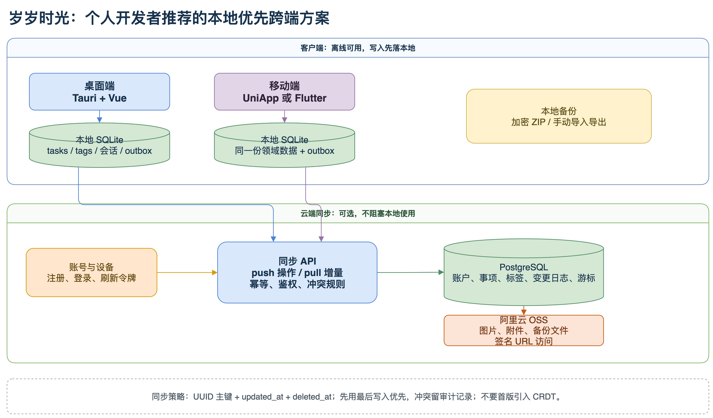

# 岁岁时光

岁岁时光是一个本地优先的个人待办与时间规划桌面应用。它用于收集事项、按周和按月安排计划，并以标签管理不同生活主题。

## 项目结构

```text
sui-time/
├── desktop-client/   # Vue 3 + TypeScript 桌面界面
├── tauri-desktop/    # Tauri 2 + Rust + SQLite 原生层
└── .github/          # macOS/Windows 发版与更新工作流
```

事项、标签、账号和本地会话均保存在应用数据目录中的 SQLite 数据库，首版不依赖服务器或云端账号。

## 数据架构



当前版本只实现图中的本地层：`sui-time.sqlite3` 位于操作系统应用数据目录，保存账号、当前会话、标签和事项。图中的移动端、同步 API、PostgreSQL 与 OSS 是后续演进规划，并非当前运行依赖。

可编辑图源见 [docs/assets/sui-time-local-first-sync.drawio](docs/assets/sui-time-local-first-sync.drawio)。

## 本地开发

```bash
cd desktop-client
npm install

cd ../tauri-desktop
npm install
npm run tauri:dev
```

## 更新发布

自动更新工作流需要在 GitHub Secrets/Variables 中配置签名密钥和独立 OSS 分发路径，详见 `.github/workflows/release.yml`。任何密钥都不应写入仓库。
